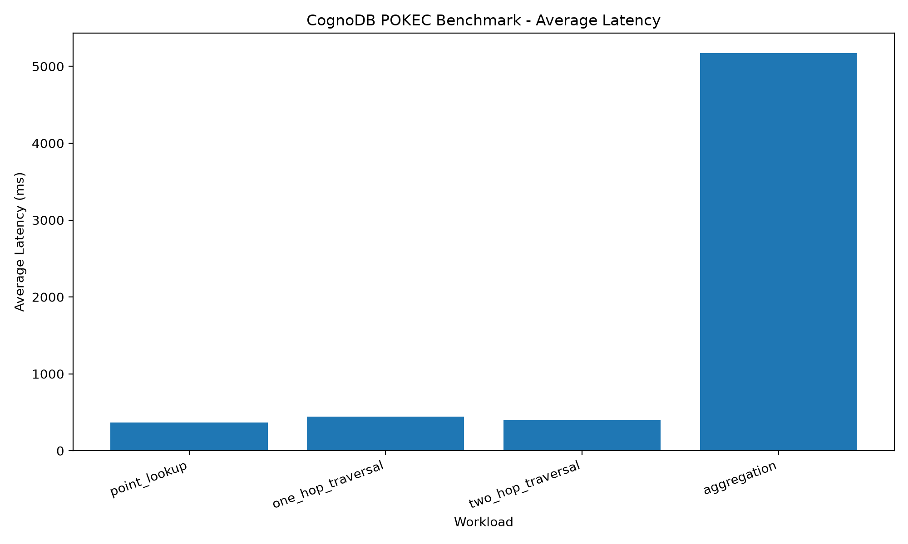
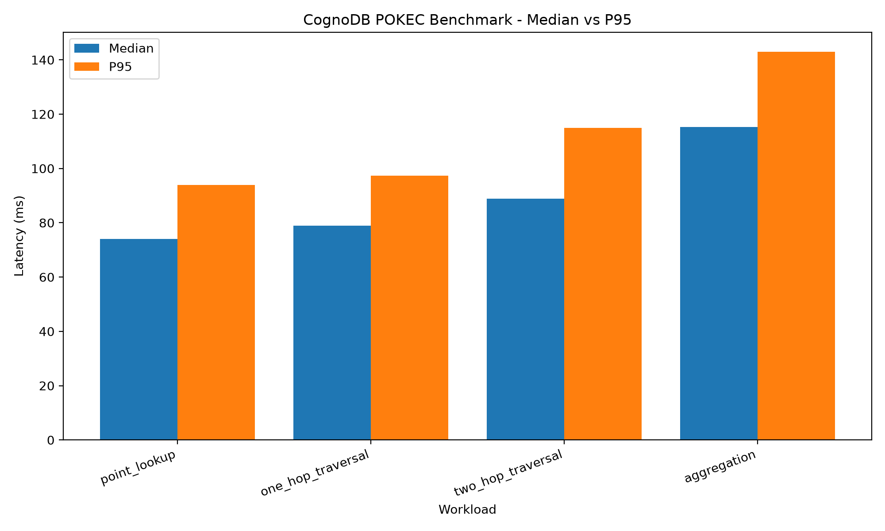
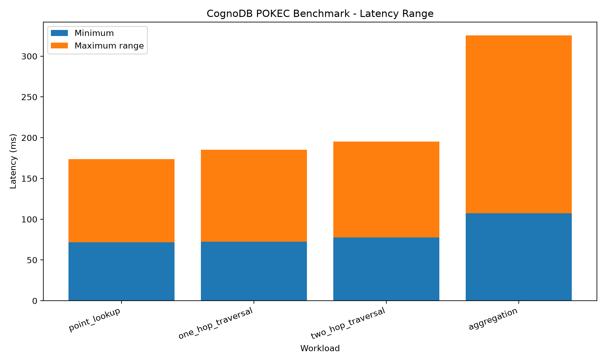

# CognoDB Cloud Benchmark

A reproducible benchmark for evaluating graph query performance on CognoDB Cloud using the Stanford POKEC social-network dataset.

## Dataset

- Dataset: Stanford POKEC
- Imported nodes: 80,712
- Imported relationships: 170,000
- Dataset file: `data/soc-pokec-relationships.txt.gz`

## Workloads

The benchmark measures:

1. Point lookup
2. One-hop traversal
3. Two-hop traversal
4. Aggregation

Each workload uses:

- 3 warm-up runs
- 20 measured runs
- Average, median, P95 and P99 latency

## Results

| Workload | Average (ms) | Median (ms) | P95 (ms) | P99 (ms) |
|---|---:|---:|---:|---:|
| Point lookup | 77.69 | 74.10 | 93.97 | 102.02 |
| One-hop traversal | 81.71 | 78.93 | 97.41 | 112.77 |
| Two-hop traversal | 91.96 | 88.89 | 114.89 | 117.61 |
| Aggregation | 121.82 | 115.25 | 143.04 | 218.17 |

All workloads completed with **20/20 successful iterations and 0 failures**.

## Charts

### Average latency



### Median vs P95



### Latency range



## Methodology

The benchmark measures query latency for representative graph workloads on CognoDB Cloud using the Neo4j-compatible Python driver.

For each workload:

- 3 warm-up runs were executed.
- 20 measured iterations were executed.
- Failed iterations were recorded separately.
- Latency was measured in milliseconds.
- Average, median, P95 and P99 latency were calculated.

## Reproducibility

Install dependencies:

```bash
pip install -r requirements.txt
